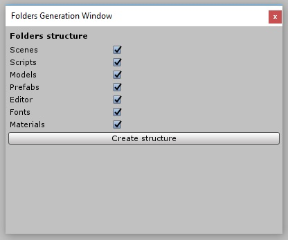
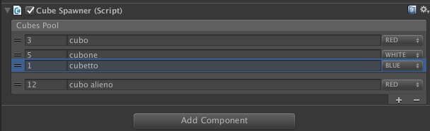

# Helpers #
Tools that will make your life easier during your development journey

## String Encryption/Decryption ##
Use Encrypt and Decrypt static methods to encrypt/decrypt string using TripleDes algorithm.
 Thanks to N3K EN for the exhaustive tutorial on encryption in Unity.
 Link to his youtube channel: https://www.youtube.com/channel/UCtQPCnbIB7SP_gM1Xtv8bDQ

## Project Folders Generation tool ##
Generates folder for your project with one click.

## Loading bar ##
Use SceneManagerAsync.cs to show a loading bar while loading next scene async.
To test the loading bar, you can make a scene heavier by using Helpers/HeavyScene menu item.
Open the HeavyScene, click on Helpers/HeavyScene and then you should have a bunch (about 1000) of new gameobjects in a container inside the canvas.
Repeat it a couple of times to make the scene heavier and heavier.

## Reorderable Inspector List ##
Since Unity 4.5 (i think), we've got a very nice tool called ReorderableList. We can find it in UnityEditorInternal namespace.
With this tool you can build custom inspectors in order to let your lists more user friendly and manageable.
As the name says, it allows you to reorder your list through the inspector and customize elements values if serializable.

